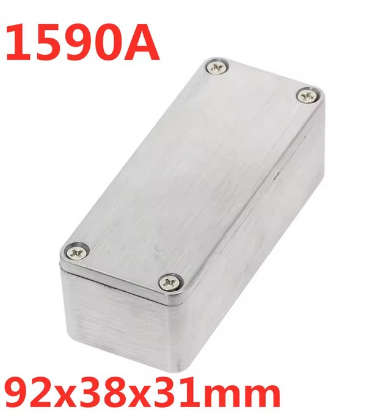
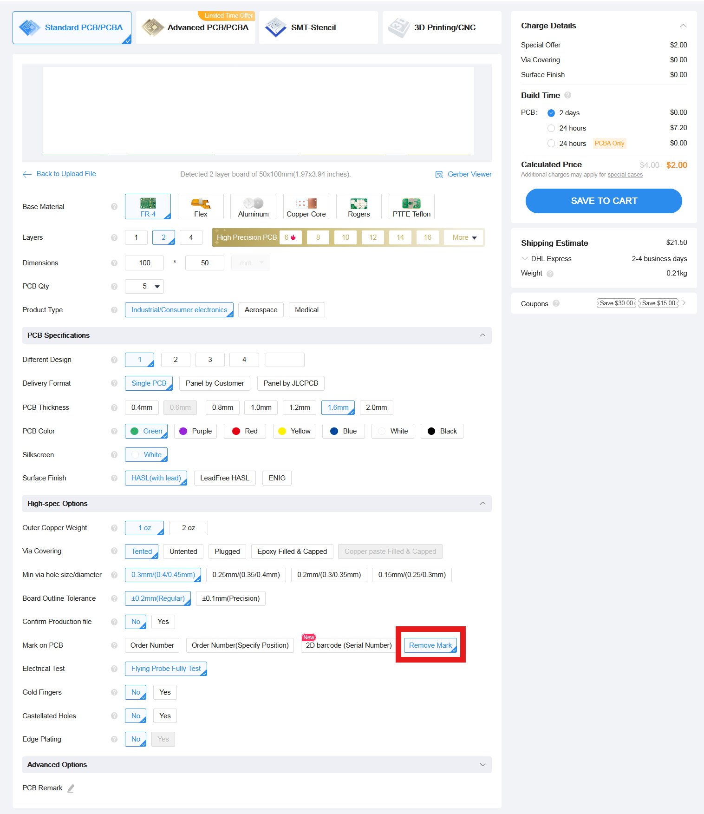

# Noise source board

## Warning! This board is still a work in progress!

This repo consists of a board for making a noise source. 


It's based on the one made by [Changpuak](https://www.changpuak.ch/electronics/Noise-Source-with-2xGVA82-15dB.php).

It's adapted to work in a enclosure like [this one](https://www.aliexpress.com/item/1005001849603652.html) of size 92x38x31mm to store it.



------------------------

## Bill of materials

```
4x 0805 1 ohm resistor (https://aliexpress.com/item/1005009264768923.html)
2x 0805 100 ohm resistor (https://aliexpress.com/item/1005009264768923.html)
3x 0805 1uF capacitor (https://aliexpress.com/item/1005005000107445.html)
2x 0805 10uF capacitor (https://aliexpress.com/item/1005005000107445.html)
2x GVA-82+ Mini-Circuits Amplifier (https://aliexpress.com/item/1005008544947091.html)
2x TCBT-14+ Mini-Circuits Bias Tee (https://aliexpress.com/item/1005007678313474.html)
2x PAT-3+ Mini-Circuits 3 dB Attenuator (https://aliexpress.com/item/1005008375039512.html)
1x SMA PCB 1.6mm long connector (https://aliexpress.com/item/1005007424915378.html)
1x 12V barrel jack connector (https://aliexpress.com/item/1005008726787916.html)
1x MC7805CDTG 5v voltage regulator (https://aliexpress.com/item/1005007905517148.html)
1x Storage box (https://www.aliexpress.com/item/1005001849603652.html)
```

------------------------

Schema:


------------------------

## Ordering the PCB:

Download the Gerber file from this repo and order it a jlcpcb with the default options.  
The only option I've changed is to remove the manufacture code mark



#### Please make sure to visit the [satcom radio website](https://satcomradio.github.io/) for more information